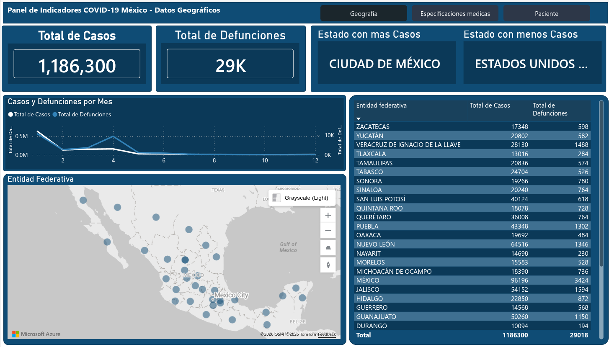
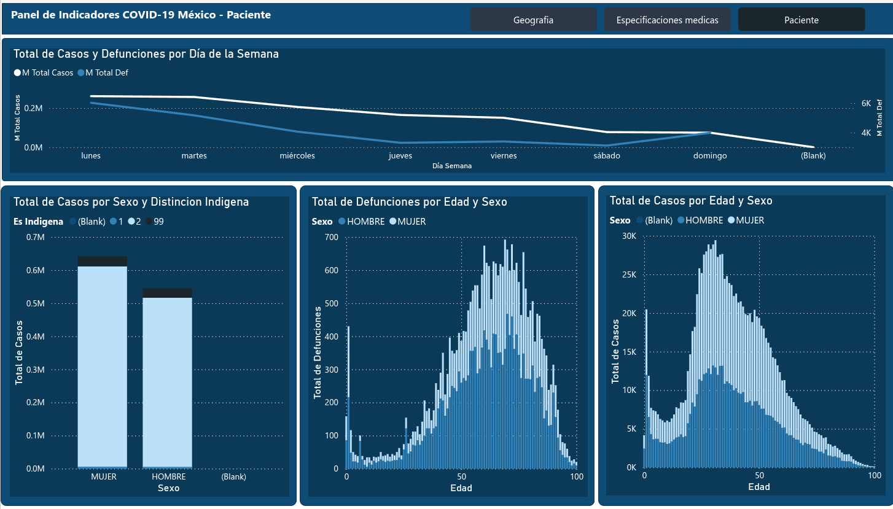

<div align="center">

# 🦠 Análisis de Datos — COVID-19 México

**Pipeline ETL completo para el análisis epidemiológico de COVID-19 en México**  
*Datos oficiales de la Secretaría de Salud · Extracción · Transformación · Carga · Visualización*

[](https://python.org)
[](https://jupyter.org)
[](https://pandas.pydata.org)
[](https://duckdb.org)
[](https://www.gnu.org/licenses/gpl-3.0)

</div>

---

## 📌 Descripción del Proyecto

Este proyecto implementa un pipeline **ETL (Extract → Transform → Load)** sobre los datos abiertos de COVID-19 publicados por la **Secretaría de Salud de México**. El objetivo es transformar datos crudos en información accionable a través de limpieza, consultas analíticas y visualizaciones de Business Intelligence.

> 💡 **Estado del proyecto:** ✅ Completado

---

## 🖼️ Vista del Dashboard




---

## 🗂️ Estructura del Proyecto

```
Data-Analysis-Covid19-Mexico/
│
├── 📁 01_EXTRACT/          # Extracción de datos desde fuente oficial
│   └── ...
│
├── 📁 02_TRANSFORM/        # Limpieza, normalización y enriquecimiento de datos
│   └── ...
│
├── 📁 03_LOAD/             # Carga a base de datos / formatos optimizados
│   └── ...
│
├── 📁 BI/                  # Dashboards y visualizaciones
│   └── ...
│
├── 📁 DATA/
│   └── Consultation/       # Consultas analíticas sobre los datos
│
├── 📁 DICCIONARIOS/        # Catálogos y diccionarios de datos oficiales
│
├── requirements.txt        # Dependencias del proyecto
└── README.md
```

---

## ⚙️ Pipeline ETL

```
┌─────────────────┐     ┌──────────────────┐     ┌────────────────┐     ┌─────────────┐
│   01 EXTRACT    │────▶│  02 TRANSFORM    │────▶│   03 LOAD      │────▶│     BI      │
│                 │     │                  │     │                │     │             │
│ · Descarga de   │     │ · Limpieza de    │     │ · Carga a BD   │     │ · Dashboards│
│   datos SS      │     │   datos          │     │ · Parquet /    │     │ · Reportes  │
│ · Validación    │     │ · Normalización  │     │   DuckDB       │     │ · KPIs      │
│   de fuente     │     │ · Join catálogos │     │                │     │             │
└─────────────────┘     └──────────────────┘     └────────────────┘     └─────────────┘
```

---

## 🛠️ Tecnologías Utilizadas

| Categoría | Herramienta | Uso |
|-----------|-------------|-----|
| Lenguaje | Python 3 | Desarrollo del pipeline |
| Análisis | Pandas, NumPy | Manipulación y análisis de datos |
| Base de Datos | DuckDB | Consultas analíticas en memoria |
| Almacenamiento | PyArrow, FastParquet | Lectura/escritura de archivos Parquet |
| Notebooks | Jupyter | Exploración y documentación |
| Reportes | OpenPyXL | Exportación a Excel |
| BI | Power BI / Looker | Visualización y dashboards |

---

## 📊 Análisis Realizados

- 📈 **Evolución temporal** de casos confirmados, defunciones y recuperados
- 🗺️ **Distribución geográfica** por estado y municipio
- 👥 **Perfil demográfico** de los pacientes (edad, sexo, comorbilidades)
- 🏥 **Análisis hospitalario** — hospitalización vs. ambulatorio
- ⚠️ **Factores de riesgo** y correlación con desenlace del paciente
- 📉 **Tasa de mortalidad** por grupo etario y entidad federativa

---

## 🚀 Cómo Reproducir el Proyecto

### 1. Clonar el repositorio

```bash
git clone https://github.com/juriel1/Data-Analysis-Covid19-Mexico.git
cd Data-Analysis-Covid19-Mexico
```

### 2. Instalar dependencias

```bash
pip install -r requirements.txt
```

### 3. Ejecutar el pipeline

```bash
# Paso 1 — Extracción
jupyter notebook 01_EXTRACT/

# Paso 2 — Transformación
jupyter notebook 02_TRANSFORM/

# Paso 3 — Carga
jupyter notebook 03_LOAD/
```

> **Nota:** Los datos originales provienen del portal de [Datos Abiertos de la Secretaría de Salud](https://www.gob.mx/salud/documentos/datos-abiertos-152127).

---

## 📦 Dependencias Principales

```txt
pandas==3.0.1
numpy==2.4.3
duckdb==1.5.1
pyarrow==23.0.1
fastparquet==2026.3.0
openpyxl==3.1.5
jupyter / ipykernel
```

> Instala todas con: `pip install -r requirements.txt`

---

## 📁 Fuente de Datos

| Campo | Detalle |
|-------|---------|
| **Fuente** | Secretaría de Salud — Gobierno de México |
| **URL** | [Datos Abiertos COVID-19](https://www.gob.mx/salud/documentos/datos-abiertos-152127) |
| **Formato** | CSV comprimido (.zip) |
| **Frecuencia** | Actualización diaria (histórico) |
| **Diccionario** | Incluido en `/DICCIONARIOS/` |

---

## 📄 Licencia

Este proyecto se distribuye bajo la licencia **GPL-3.0**. Consulta el archivo [LICENSE](./LICENSE) para más detalles.

---

## 👤 Autor

**Juriel** — Analista de Datos | Aspirante a Data Engineer & Data Scientist

[](https://github.com/juriel1)

---

<div align="center">
  <sub>⭐ Si este proyecto te fue útil, considera dejar una estrella en el repositorio</sub>
</div>
